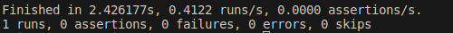
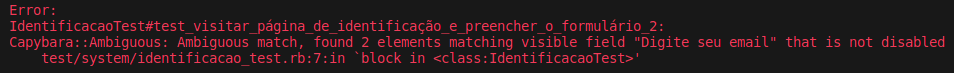
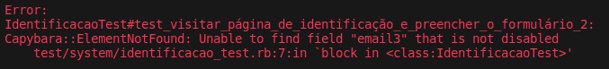

Os testes automatizados, especialmente os testes de interface do usuário, envolvem interações com elementos da página, como links, botões, formulários e outros. No Capybara, existem muitas maneiras de interagir com esses elementos. Vamos explorar como você pode identificar, selecionar e interagir com os elementos HTML em suas páginas web.

### Identificando Elementos HTML

Para poder interagir com um elemento HTML, é necessário localizá-lo. Para localizar elementos na página, o Capybara fornece uma série de métodos, que permitem selecionar elementos por suas tags, texto, valor, ID, classe CSS e muito mais.

Antes de aprofundar mais neste tópico, vale a pena reforçar: **a boa prática recomenda que elementos HTML tenham ID's únicos para facilitar sua identificação e manipulação**. O mesmo não ocorre com outros seus atributos. Por isso, é uma boa prática usar o ID ao identificar elementos. Isto se dá principalmente pela forma como o Capybara lida ao encontrar mais de um elemento com o mesmo parâmetro de identificação.

Navegue até a página de **teste de identificação** no site de apoio. Lá você verá que há dois formulários idênticos; ao utilizar a ferramenta de inspeção é possível ver que a única coisa que os diferencia é seu ID.

Claro que se trata de uma situação hipotética. Você dificilemente verá dois formulários idênticos, com o mesmo objetivo, em uma página. No entanto é possível que haja diferentes formulários cujo algum dos campos seja muito semelhante. Imagine que em uma mesma página você pode realizar um login, e há um campo que recebe um e-mail, mas ao final da página também há um campo que recebe o e-mail do usuário, mas esse campo é para a inscrição em uma *newsletter*. Provavlmente ambos os campos terão o mesmo placeholder, nome e classe, mas seu ID será único.

Para verificar na prática, crie um arquivo de teste com o nome **identificacao_test.rb** dentro da pasta ```test/system```.

Adicione ao arquivo o conteúdo:

```
class IdentificacaoTest < ApplicationSystemTestCase

  test "visitar página de identificação encontrar formulário 2" do
    visit identificacao_path
    find_field "email2"
  end

end
```

Em seguida, execute apenas este teste com o comando

```
rails test test/system/identificacao_test.rb 
```

A saída do terminal indica que o teste foi executado com sucesso, sem falhas



O teste acessa a página de identificação usando o método ***visit*** e, em seguida, tenta encontrar um campo de formulário usando o método * **find_field** *. Ao utilizar parâmetro **email2** o capybara encontrará o campo pelo seu ID. Não precisamos especificar qual atributo estamos procurando (name, ID, placeholder, etc), só precisamos passar um parâmetro válido e o método irá determinar do que se trata.

### Elementos duplicados

Agora imagine que no exemplo acima, ao invés de utilizar um ID único para encontrar um elemento fosse utilizado o placeholder do campo do formulário.
Mude o parâmetro **email2** para **Digite seu email**

```
  test "visitar página de identificação encontrar formulário 2" do
    visit identificacao_path
    find_field "Digite seu email"
  end
```

Se executarmos o teste novamente, uma mensagem de erro será exibida no terminal



A mensagem de erro ***Ambiguous match*** é uma exceção lançada pelo capybara quando mais de um elemento é encontrado com o parâmetro passado. Como os dois formulários utilizam o mesmo placeholder para o e-mail, o Capybara então informa que é dois elementos foram encontrados com o mesmo campo **Digite seu email**.

:::tip Dica
Como não é necessário especificar o tipo de elemento no parâmetro é possível que o erro de ***Ambiguous match*** ocorra mesmo que um elemento tenha um atributo igual a um diferente tipo de atributo de outro elemento. Por exemplo, se um elemento tem um label com o mesmo nome do ID de outro elemento o erro ainda irá ocorrer. Para garantir que você está procurando por um ID, adicione # como prefixo, ficando desta forma find_field "#email2".
:::

### Elementos inexistentes

Agora repita o teste, modificando o parâmetro do método ***find_field*** para **email3**

```
  test "visitar página de identificação encontrar formulário 2" do
    visit identificacao_path
    find_field "email3"
  end
```

Desta vez, ao executar o teste a mensagem de erro será diferente



A mensagem de erro ***Element Not Found*** é uma exceção lançada pelo capybara quando nenhum elemento é encontrado com o parâmetro passado. Ao se deparar com o erro tente primeiramente verificar com a ferramenta de inspeção se é de fato nome do atributo que você está procurando
