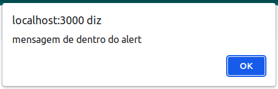
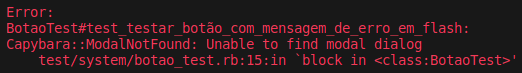
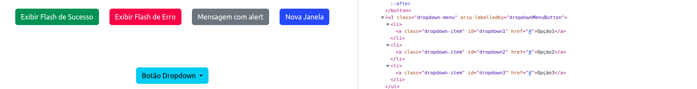

Os botões são uma das principais formas de interação com páginas WEB. São responsáveis por submeter formulários, abrir pop up e modais, redirecionar para outras páginas, entre outras coisas. Essa seção irá lhe ensinar como interagir com os botões mais comuns.

Utilize o arquivo **botao_test** para adicionar os seus testes.

Navegue até a página **Botões** e clique em cada botão para entender o que eles fazem. Depois volte a este tutorial para testar cada um deles.

Estes testes serão feitos com todos os botões, da esquerda para a direita.

## Método *click_button*

Nesta seção será utilizado o método ***click_button*** para interagir com os botões. Este método procura por um botão cujo atributo tenha o nome passado como parâmetro, podendo ser uma classe, ID, etc. 

:::caution Atenção:
O método ***click_button*** procura apenas por **botões**, e portanto não é possível interagir com links ou outros elementos que "parecem" botões. Caso você tente interagir com elementos que não são botões, mesmo que utilize o identificador com o nome correto o teste não funcionará da forma adequada.
:::

### Botão "Exibir Flash de Sucesso"

Comece com um teste que verifica se a mensagem foi mostrada na tela:

```
test "testar botão com mensagem de sucesso em flash" do
  visit botoes_path
  click_button "botaoflashsucesso"
  assert_text "Sucesso!"
end
```

* Este teste começará visitando a página de **Botões** utilizando o método ***visit***, que você já conhece;

* Após, ele chamará o método ***click_button***. Neste caso estamos procurando pelo botão utilizando seu ID **botaoflashsucesso**;

* Por fim, um novo método, o ***assert_text***. Este método procura por um texto EXATO, ou seja, ele diferenciará maiúsculas de minúsculas e irá comparar também os símbolos. O texto que procuramos é **"Sucesso!"**, que é exibido na forma de uma mensagem *flash*;

* Como o texto foi encontrado, o teste é finalizado sem erros e com 1 assertion.

:::info flash e assert_text
Para mais informações sobre ***assert_text***, consulte (TO DO).

As mensagens flash são uma maneira conveniente de exibir mensagens temporárias entre as requisições na sua aplicação Rails. Elas são armazenadas em uma sessão de cookie especial, que é apagada depois da próxima requisição. Caso não esteja familiarizado com o conceito, consulte a [documentação sobre flash](https://api.rubyonrails.org/classes/ActionDispatch/Flash.html) para aprender o que são e como criar suas próprias mensagens *flash* personalizadas.
:::

Como você pôde perceber, ao testar botões é necessário checar o estado da página após clicar no botão. Por isso, a verificação se mensagem foi exibida ocorre somente depois de clicar nele. É possível fazer um teste para verificar se a mensagem não é exibida antes, para garantir que não há mensagens sendo exibidas de forma displicente na página, mas isso vai da necessidade da aplicação que você está testando.

Há um pequeno problema com esse teste que foi comentado no tópico [escrevendo bons testes](/docs/Capybara/Escrevendo%20bons%20testes). Antes de prosseguir, você consegue identificar qual é? Pense um pouco ou mesmo retorne para a seção para tentar descrobrir...

.

.

.

.

.

.

.

**Conseguiu descobrir ?**

.

.

.

.

.

.

Existe uma diretriz que nos pede para [evitar testes frágeis](/docs/Capybara/Escrevendo%20bons%20testes#evite-testes-fr%C3%A1geis). Pense na seguinte hipótese: ao invés de escrever "Sucesso!" a página agora irá começar a exibir uma mensagem mais clara para o usuário, como "O botão de sucesso está funcionando!". Diante dessa hipótese o teste irá falhar, mesmo que a aplicação ainda esteja funcionando corretamente.

Pensa da seguinte forma: neste caso, o objetivo ao clicar no botão não é exibir uma mensagem escrito "X" ou "Y", mas sim exibir alguma mensagem de sucesso, seja ela qual for, para que termos certeza de que a solicitação foi atendida de forma correta.

Acompanhe o próximo exemplo para entender como lidar com este problema.

### Botão "Exibir Flash de Erro"

Adicione um novo teste dentro de sua classe de testes de botão

```
test "testar botão com mensagem de erro em flash" do
  visit botoes_path
  click_button "botaoflasherro"
  assert_selector('.alert.alert-danger')
end
```
Esse teste se assemelha muito ao anterior, a única diferença importante é quanto ao método ***assert_selector***. Este método procura se há algum elemento que possui os parâmetros passados. Então ao invés de verificar a mensagem exata de erro, nós verificamos se há algum elemento com as classes *alert* e *alert-danger* passadas como parâmetro.

Três pontos importantes merecem nossa atenção aqui:

* Primeiro, o uso de uma classe em vez de um ID para localizar um elemento na página. Este tutorial já destacou a importância de usar IDs para individualizar os elementos HTML, então, por que agora sugerimos o uso de uma classe? Isso se deve à maneira como as mensagens flash são geradas no Rails. É raro que cada mensagem flash tenha um ID personalizado. Mesmo que os IDs sejam gerados, provavelmente seriam feitos de maneira dinâmica e aleatória, que é como os desenvolvedores Rails geralmente criam mensagens flash. Dado esse cenário, é mais apropriado procurar a presença da classe do alerta na tela, pois isso indica que alguma mensagem está sendo exibida. Além disso, se é uma "alert-danger", podemos inferir que é uma mensagem de erro.

* Em segundo lugar, a questão de determinar qual tipo de alerta é exibido para cada mensagem. O Rails oferece algumas convenções, como criar mensagens flash com :notice para sucesso ou :alert para erros. No entanto, nesta aplicação usamos :success e :danger para estilização com Bootstrap, uma abordagem comum para desenvolvedores que usam Rails com Bootstrap. Então, como saber qual das duas abordagens usar? Isso depende muito da arquitetura do software e das decisões do time de desenvolvimento. É essencial que o time defina uma regra para ser seguida por todos, a fim de facilitar a leitura e manutenção do código, bem como a criação de testes. Portanto, antes de escolher qual abordagem usar, você precisa entender como a aplicação está sendo construída.

* Por último, até agora você  utilizou aspas simples ou aspas duplas e colocou o parâmetro entre elas, e assim o próprio Capybara inferiu se tratava-se de um ID, uma classe, um placeholder, ou algum outro atributo do elemento HTML. Desta vez, além das aspas utilizamos o ponto (**.**). Isto diz ao Capybara que estamos procurando por uma classe. Ao invés de permitir que ele procure entre todos os atributos o ponto o força a procurar por uma classe com o nome. Como colocamos uma classe atrás da outra ligada por dois pontos estamos dizendo que é necessário que estas classes estejam nessa ordem no mesmo elemento HTML. 

:::danger Cuidado!
Alguns métodos do Capybara não são capazes de inferir o tipo de atributo do elemento procurado! Por exemplo, o método find_field consegue identificar o tipo de campo independentemente de como você passa o argumento. No entanto, para o método assert_selector e outros semelhantes, é necessário passar um seletor que identifique explicitamente o atributo que estamos procurando. Por exemplo, .alert para uma classe ou #myID para um ID. Certifique-se de sempre verificar a documentação e entender como os métodos que você está utilizando lidam com argumentos.
:::

### Botão "Mensagem com Alert"

Embora seja comum utilizar *flash* para criar as mensagens no rails, ainda é possível que as mensagens sejam exibidas em uma janela de *alert*.

Para verificar como lidar com essa situação, veja o exemplo abaixo:

```
test "testar botão de mensagem com alert" do
  visit botoes_path
  click_button "botaomensagemalert"
  alert_text = accept_alert
  assert_equal 'mensagem de dentro do alert', alert_text
end
```

No caso do teste de um alerta não é possível procurar elementos, isto porque os elementos de um alert não são parte do DOM. Ainda assim o Capybara oferece algumas maneiras de lidar com isso:

* Caso esteja criando um teste que precisa aceitar a mensagem, utilize o método ***accept_alert***. Ele irá procurar um modal na página e aceitar a mensagem, neste caso clicando em **ok**;

* No caso de recusar uma mensagem, utilize o método ***dismiss_confirm***;

* Por fim, existem aquelas casos onde uma mensagem de alerta aparece pedindo que você digite algo, como por exemplo ao apagar um repositório no github ele pede para confirmar o nome do repositório antes. Nestes casos utilize o método ***accept_prompt***, e como parâmetro escreva o texto desta forma **(with: 'texto desejado')**. Assim o alerta será aceito com a mensagem passada.

Todos os métodos acima retornam o texto de dentro alerta. No nosso caso o texto **mensagem de dentro do alert**:



Desta forma, podemos verificar se um alerta foi gerado, com o método ***accept_alert***, salvamos o seu retorno dentro de uma variável, e comparamos com o texto que queríamos que fosse exibido utilizando o ***assert_equal***.

Todavia, já vimos que não é uma boa prática verificar o texto exato de uma mensagem de erro ou sucesso, por isso, apenas utilizar ***accept_alert*** seria suficiente. Caso um alerta não seja gerado pelo botão, um erro informando que o elemento não foi encontrado será gerado:



Assim, o ***accept_alert*** sozinho garante que o usuário verá uma mensagem ao clicar no botão.

### Botão "Nova Janela"

Este botão irá criar uma nova janela no navegador. O desafio neste caso é verificar qual página foi aberta.

Para fazer esse teste é necessário adicionar subetapas ao teste:

```
test "testar botão de nova janela" do
  visit botoes_path

  janela_aberta = window_opened_by do
    click_button "botaonovajanela"
  end

  within_window janela_aberta do
    assert_selector('#titulosite')
  end
end
```

Destrinchando o teste acima temos:

``` 
janela_aberta = window_opened_by do
  click_button "botaonovajanela"
end
```

* Nesta parte, o método ***window_opened_by*** irá retornar uma janela aberta ao clicar no botão **Nova Janela**. Esta janela então é salva em uma variável chamada **janela_aberta**;

* Com a variável contendo todos os elementos DOM da janela aberta, utilizamos o método ***within_window*** com um bloco de código, passando como parâmetro a variável **janela_aberta**;

* Dentro deste bloco de código, verificamos se essa janela que foi aberta possui o elemento que queremos, utilizando o método ***assert_selector***.

Claro que este é apenas um exemplo, a forma você irá identificar qual janela foi aberta depende do seu caso.

## *click_link*

Conforme mencionado anteriormente, alguns links podem ter a aparência de botões, então apra interagir com eles deve-se utilizar o método ***click_link***. Caso não se lembre, pode revisitar seu objetivo [aqui](/docs/Capybara/Guia%20de%20Testes/Navegação#click_link).

## *click_on*

Também é possível fazer com que o Capybara interaja tanto com links quanto com botões utilizando o método ***click_on***. Ele funciona como uma combinação dos métodos ***click_button*** e ***click_link***, não sendo necessário específicar exatamente qual dos elementos você está interagindo.

### Botão "Dropdown"

Um botão de dropdrow funciona de forma similar aos outros botões, basta interagir com ele com o método adequado para que os elementos "escondidos" sejam exibidos. A partir de então, interaja com os elementos dentro do dropdown.

```
test "testar botão dropdown" do
  visit botoes_path
  
  click_button "botaodropdown"
  click_on "dropdown1"

  accept_alert
end
```

Observe o exemplo acima:

* Primeiro, o teste clica no botão Dropdown para exibir as opções do menu;

* Agora, os itens são exibidos e é possível interagir com eles. Então o método ***click_on*** é utilizado para clicar na opção 1;

* Sabendo que um *alert* deveria exibido, o teste utiliza o método ***accept_alert*** para garangir que tudo está correto.

Perceba que foi utilizado o método ***click_on*** ao invés do ***click_button***, uma vez que o elemento no dropdrown não é um botão, mas sim um link. Claro que o método ***click_link*** também poderia ter sido utilizado, mas ao invés de preocupar-se com o exato elemento exibido, a única coisa que o teste busca neste caso é interagir com ele, então não é necessário garantir o elemento exato. Neste exemplo, o elemento é um acessório, e não um fim, e o seu tipo pode ser desprezado.

Lembre-se, para interagir com os elementos dentro do dropdown, o botão dropdown deve ser clicado primeiro. Quando interagimos com a página utilizando a ferramenta de inspeção de desenvolvedor é possível verificar que os elementos do dropdown podem ser inspecionados mesmo antes de expandir o botão de dropdown, conforme mostra a imagem abaixo:



No entanto, caso você tente interagir com estes elementos antes de interagir com o botão de dropdown, um erro será apontado, dizendo que o elemento não existe. **Mas se eu consigo ver o elemento pela ferramenta de inspeção, por qual motivo não consigo interagir com ele?** O Capybara é uma ferramenta que emula o comportamento de um usuário, então se um elemento não está disponível para o usuário, ou seja, se ele não está visível, não é possível para o Capybara interagir. Isto é especialmente útil para que seja possível verificar se o usuário consegue ou não ver e interagir com determinados elementos na página Web, ainda que a página HTML contenha estes elementos. Por exemplo, um elemento pode não estar sendo renderizado corretamente devido a um erro no script da página. O comportamento do Capybara pode ajudar a identificar este tipo de problema.