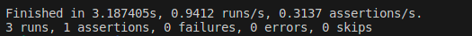
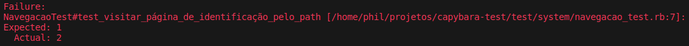

Nesta seção você irá aprender um pouco mais sobre os métodos de navegação mais comuns e seus parâmetros.

## Visitando uma página específica

Como você pôde perceber, o método ***visit*** é utilizado em quase todos os testes do Capybara.

Para visitar uma página basta adicionar esta página como parâmetro ao método ***visit***. Esta página não precisa estar presente na aplicação, pode ser qualquer página acessível na internet.

:::caution Atenção:
Ao tentar acessar qualquer página, o Capybara por padrão adiciona ao caminho URL a porta que está sendo utilizada. Testes que navegam até páginas externas falharão,como ***visit ("https://orcafascio.com/")***. Isso ocorre pois ele fará uma chamada em uma porta específica, e o endereço será transformado em algo como **https://orcafascio.com:4045/**. Já que esta porta não é acessível o método falhará. 
Para contornar este problema você deve mudar sua configuração Capybara para modificar o parâmetro ***always_include_port = false***. No entanto essa mudança pode trazer problemas ao fazer teste locais. Para mais detalhes sobre esse erro consulte a [documentação sobre visit](https://www.rubydoc.info/gems/capybara/Capybara%2FSession:visit).
:::

Crie um novo arquivo de teste dentro da pasta *system* para criar os testes de navegação. Para seguir o padrão utilizado até agora, chamaremos o arquivo de **navegacao_test.rb**.

Adicione os seguintes testes

```
require "application_system_test_case"

class NavegacaoTest < ApplicationSystemTestCase

  test "visitar página de identificação pelo path helper" do
    visit identificacao_path
  end

  test "visitar página de identificação pelo url absoluto" do
    visit 'http://localhost/identificacao'
  end
  
  test "visitar página de identificação pelo path" do
    visit '/identificacao'
  end
end
```
Os três testes tem o mesmo objetivo: acessar a página de identificação da aplicação de teste. Mesmo sem especificar a forma de acesso o método ***visit*** consegue identificar como irá fazer a navegação. O resultado do teste não aponta nenhum erro:


## Como verificar se a navegação está correta ?

Como foi observado acima, nenhum erro foi apontado ao navegar até a página de identificação. Mas como verificar se a página visitada é realmente a página que queríamos? Suponha, por exemplo, que ocorreu um erro de rota e ao invés de ser direcionados à página de identificação o path **/identificacao** está nos direcionando a página principal. Como seria possível checar se a rota é a correta?

Os testes de navegação podem ser utilizados para esse tipo de verificação também. Ao visitar uma página através de seu caminho é possível checar os elementos presentes naquela página e assim confirmar se de fato a rota está correta e a navegação ocorreu.

Modifique o seu teste para incluir uma checagem de elemento

```
  test "visitar página de identificação pelo path" do
    visit '/identificacao'
    assert_equal 2, all('form').length
  end
```

Perceba que este novo teste agora tem 1 assertion, mas continua com 0 falha:



Esse teste faz diversas ações na linha do ***assert_equal***. Para entender melhor, vamos destrinchá-la:

* Em primeiro lugar, o método ***assert_equal*** é um método simples, ele recebe 2 argumentos e verifica se ambos são iguais. Você pode entendê-lo como: o argumento 1 é igual ao argumento 2? Se forem iguais, o teste passará, se forem diferentes o teste falhará;

* Foram passados dois parâmetros para o teste, o primeiro é um número simples, o número **2**. O segundo parâmetro, passado depois da vírgula, é **all('form').length**;

* O método ***all*** retorna TODOS os elementos de uma página. Mas neste caso ele recebeu o parâmetro ***form***, o que significa que de todos os elementos da página ele irá retornar apenas os formulários;

* Quanto ao objeto retornado pelo método ***all*** nós iremos pegar apenas o tamanho, e não o elemento em si, por isso o uso do método ***length*** Como existem dois formulários na página, ele retorna o número 2.

* Por fim, o assert_equal então retorna *true*, pois 2 é igual a 2, e portanto o teste passou.

Claro que este é apenas um teste hipotético e apenas verificar o número de formulário não é o suficiente para dizer que a página atual é de fato a que estávamos procurando. A verificação dos elementos e textos irá depender de cada caso concreto e de como a aplicação toda está arranjada.

Apenas para fins didáticos, mude o valor de 2 do ***assert_equal*** para 1, e deixe-o desta forma:

```
  test "visitar página de identificação pelo path" do
    visit '/identificacao'
    assert_equal 1, all('form').length
  end
```

Agora uma mensagem de erro irá aparecer:



A mensagem indica estava esperando apenas 1 elemento de formulários, mas que 2 foram encontrados, e isso representa uma falha.

:::tip Dica:
Lembre-se: há várias formas de verificar se você está de fato na página que esperava. Pode ser verificando elementos HTML presentes, através de textos ou mesmo se elementos não estão presentes, como por exemplo em uma página de leitura onde não deve haver elementos de formulário.
No final os testes irão depender da aplicação que você está testando.
:::

## Outros métodos de navegação

### click_link

Além do método ***visit*** o Capybara permite que as páginas sejam visitadas clicando em *links*

Adicione um novo teste ao seu arquivo para verificar como fazer isso

```
test "visitar página de identificação pelo link da navbar" do
  visit '/'
  click_link 'linkidentificacao'
  assert_equal 2, all('form').length
end
```

Neste caso, ao invés de iniciar diretamente na página de identificação, o teste começa na página *root*, clica no *link* da navbar e depois faz a checagem pelo número de formulários para garantir que está na página de identificação.

### go_back e go_forward

Esses dois métodos simulam a interação com o o histórico do navegador através das ações de voltar (***go_back***) ou avançar em uma página (***go_forward***); assim como as setas na parte superior do navegador. São métodos situacionais e que tem aplicações muito específicas.

Por exemplo, imagine uma situação em que um usuário preenche um formulário, clica em enviar, mas esquece de preencher um campo obrigatório. A aplicação pode então apresentar uma mensagem de erro e o usuário pode querer voltar para a página anterior para verificar as informações que digitou antes de preencher o formulário. A aplicação pode se comportar de duas formas neste caso: apagar os valores preenchidos e não permitir que o usuário recupere os valores digitados anteriormente, ou manter os valores salvos para que ele revise apenas os campos errados. Com esse método é possível verificar se algum desses comportamentos está presente e de acordo com a especificação do software.