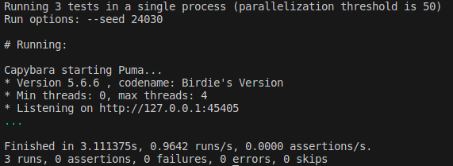

Nesta seção você irá aprender um pouco mais sobre os métodos de navegação mais comuns e seus parâmetros.

### Visitando uma página específica

Como você pode perceber, o método ***visit*** é utilizado em quase todos os testes do Capybara.

Para visitar uma página basta adicionar esta página como parâmetro ao método ***visit***. Esta página não precisa estar presente na aplicação, pode ser qualquer página acessível na internet.

:::caution Atenção:
Ao tentar acessar qualquer página, o Capybara por padrão adiciona a porta que está sendo utilizada, e testes que navegam até páginas externas, como ***visit ("https://orcafascio.com/")*** falharão pois ele fará uma chamada em uma porta específica, e o endereço será transformado em algo como **https://orcafascio.com:4045/**. Já que esta porta não é acessível o método falhará. 
Para contornar este problema você deve mudar sua configuração Capybara para modificar o parâmetro ***always_include_port = false***. Para mais detalhes sobre esse erro consulte a [documentação sobre visit](https://www.rubydoc.info/gems/capybara/Capybara%2FSession:visit).
:::

Crie um novo arquivo de teste dentro da pasta *system* para criar os testes de navegação. Para seguir o padrão utilizado até agora, chamaremos o arquivo de **navegacao_test.rb**.

Adicione os seguintes testes

```
require "application_system_test_case"

class NavegacaoTest < ApplicationSystemTestCase

  test "visitar de identificação pelo path helper" do
    visit identificacao_path
  end

  test "visitar de identificação pelo url absoluto" do
    visit 'http://localhost/identificacao'
  end
  
  test "visitar de identificação pelo path" do
    visit '/identificacao'
  end
end
```
Os três testes tem o mesmo objetivo: acessar a página de identificação da aplicação de teste. Mesmo sem especificar a forma de acesso o método ***visit*** consegue identificar como irá fazer a navegação. O resultado do teste não aponta nenhum erro:




### Como verificar se a navegação está correta ?

