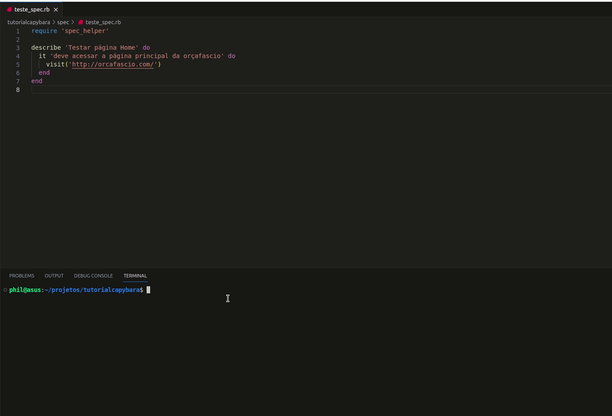
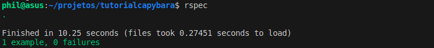
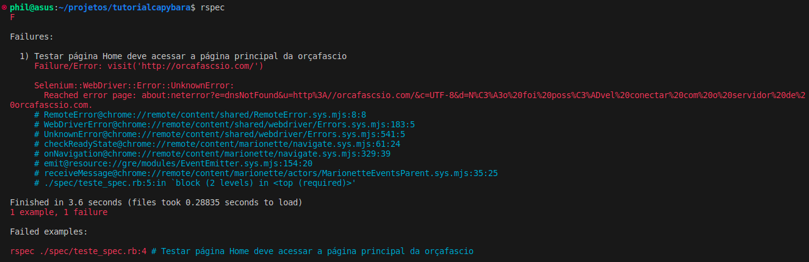

### Regras gerais para uso do Rspec

Em primeiro lugar, é necessário que todos os testes criados utilizando o Capybara em conjunto com o Rspec estejam dentro da pasta **spec**. Isto porque, por convenção, o Rspec procura por testes no diretório **spec** quando executado.

Além disto, devemos nomear os nossos testes com o final **_spec.rb**: 
* **_spec** sinaliza para o Rspec que aquele arquivo contém uma suíte de testes a ser executada;
* **.rb** determina que a extensão do arquivo é Ruby. 

:::info Info:
  O RSpec é uma ferramenta de testes completa, composta de múltiplas bibliotecas. No entanto, não iremos nos aprofundar na sua utilização, pois objetivo deste tutorial é utilizá-lo apenas como um suporte para o aprendizado do Capybara. Não deixe de consultar a [documentação](https://rspec.info/documentation/) para entender um pouco mais sobre o seu uso.
:::

### Criando o primeiro arquivo de teste

Seguindo as regras acima, vamos criar nosso primeiro teste dentro da pasta spec com o nome **teste_spec.rb**

```
touch spec/teste_spec.rb
```

Dentro do nosso arquivo iremos adicionar o nosso require, para carregar as configurações do Rspec, e adicionar o nosso primeiro teste. 

Este é um teste simples, com o objetivo de acessar a página Home da **orçafascio**.

```
require 'spec_helper'

describe 'Testar página Home' do
  it 'deve acessar a página principal da orçafascio' do
    visit('https://orcafascio.com/')
  end
end
```

### Entendendo a estrutura de um teste

Vamos destrinchar cada linha do teste que criamos:

___
```
describe 'Testar página Home' do

end
```
Conforme vimos anteriormente, o RSpec, assim como o Capybara, tem como objetivo deixar os testes mais próximos da nossa linguagem. Desta forma, ao criar um teste com o RSpec começamos descrevendo o que aquele grupo de teste irá fazer. Neste caso, o nosso grupo de testes irá testar funções e atividades relacionadas a página Home.

Poderíamos adicionar testes de outras páginas nesse grupo. Porém seria uma má-pratica, pois sairíamos do escopo definido pelo nosso * **describe** *, e tornaria mais difícil encontrar onde cada teste está localizado para fazermos a manutenção do código, além de diminuir sua legibilidade.

Por fim, o * **end** * ao final apenas está sinalizando que aquele grupo de testes iniciados na palavra * **do** * foi encerrado.

___
```
it 'deve acessar a página principal da orçafascio' do

end
```

A palavra * **it** * é usada para definir um exemplo ou um caso de teste específico dentro do grupo de testes definido pelo bloco describe. Cada caso de teste começa com * **it** *, seguido de uma descrição do que é esperado que aconteça nesse teste. A descrição deve ser escrita de uma maneira que seja fácil de entender para qualquer pessoa que esteja lendo o teste.

Neste caso, **'deve acessar a página principal da orçafascio'** é a descrição do nosso caso de teste. Quando o RSpec executa esse teste, é isso que esperamos que aconteça. Se a expectativa for atendida, o teste será bem-sucedido. Se não, o teste falhará.

A palavra do inicia o bloco de código que define o que exatamente o teste fará para verificar se a expectativa é atendida. Neste exemplo, ainda não temos nenhum código dentro deste bloco, mas é aqui que colocaremos nosso código de teste.

Assim como com o bloco * **describe** *, o * **end** * ao final do bloco * **it** * sinaliza que este caso de teste específico foi encerrado.

___
```
visit('https://orcafascio.com/')
```

Enquanto as palavras * **describe** * e * **it** * são palavras reservadas do RSpec, o método * **visit** * é a primeira palavra que vemos que é própria da gem Capybara. O método * **visit** * é usado para instruir o Capybara a navegar para uma URL específica. Neste caso, estamos dizendo ao Capybara para visitar a página inicial do site da orçafascio, e desta forma apenas esse método já é capaz de por si só realizar o teste definido dentro do bloco * **it** *.

Conforme vimos no exemplo, a URL passada como parâmetro começa com o protocolo **https**, isto porque, da forma como estamos passando o parâmetro, somos obrigados a incluir o protocolo da conexão antes do endereço. 

:::caution Atenção:
Poderíamos utilizar também o protocolo **http** para acessar esta página em específico, pois o servidor web da orçafascio automaticamente faz o redirecionamento para o protocolo **https**. No entanto, se suprimirmos o protocolo o método * **visit** * falhará, e por consequência nosso teste também.
:::

Este método será um dos principais utilizados, pois ele é o responsável pela navegação do Capybara. Veremos este método de forma mais detalhada posteriormente, mas em linhas gerais ele é responsável por visitar uma página web passada como parâmetro.

### Executando o RSpec

Para executar todos os testes, basta que executemos o comando ```rspec``` no terminal. Simples assim.

Ao executar o código você verá algo semelhante ao gif abaixo:



### Verificando o resultado do Rspec

Ao final do teste, o RSpec nos informa o tempo total para executar os testes, o tempo para fazer a leitura dos arquivos, a quantidade de testes e a quantidade de falhas.

Caso não haja falhas e todos os testes passem, a saída que nos informa sobre os testes será parecida com a imagem abaixo:



Caso contrário, ele trará uma descrição específica sobre os erros:



Podemos ver que quando um teste falha, o Rspec nos trás detalhes sobre o teste que falhou, com o nome do grupo de teste, o nome do exemplo de teste e até o método específico que apresentou falha. Neste caso, podemos ver que o erro se deu nesta parte 

```Failure/Error: visit('http://orcafascsio.com/')```

Aqui fica ainda mais clara a necessidade de darmos nomes descritivos aos nossos grupos e exemplos de testes, pois torna muito mais dinâmica e fácil a leitura das mensagens.

O erro ocorreu pois a URL está incorreta, e o endereço **http://orcafascsio.com/** não existe. Sem nos atentarmos ao terminal, este erro poderia ser difícil de compreender, pois apenas uma letra extra na URL causou a falha. O Rspec então nos auxilia a encontrar sem dificuldades o problema.

:::note Erros:  
A maior parte dos problemas poderá ser resolvida apenas verificando o terminal e suas mensagens de erro. Iremos abordar futuramente quais as mensagens de erro mais comuns e também outras formas de fazer o debug.
:::