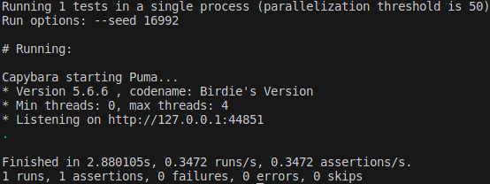
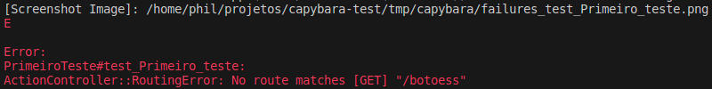

Neste tópico você irá aprender a criar um teste simples com Capybara, como executá-lo e como entender as mensagens de falha ou sucesso de um teste.

## Diretório e nomenclatura

Para criar um teste unindo Capybara e Rails é necessário entender primeiro a estrutura utilizada para rodar a sua suíte de testes.

A depender da ferramenta utilizada para executar os testes, a estrutura do arquivos de testes, seus nomes e a forma de executá-los irá mudar.

Por exemplo, se você utilizar o Rspec é necessário que os arquivos de testes tenham o sufixo **_spec.rb**, caso utilize o Cucumber, é necessário que eles estejam dentro de um diretório específico.

No caso dos exemplos utilizados neste tutorial, o Rails será o responsável por executar os testes. Por conta do padrão utilizado pela combinação de Rails e Capybara os testes serão colocados dentro da pasta **test/system**, e todos os testes devem terminar com o sufixo **_test.rb**

## Organizando seus testes

É possível agrupar os testes de diferentes formas: por funcionalidade, objetivo, páginas testadas, controllers, etc. Neste projeto os testes foram divididos de forma a facilitar a navegação pelas seções presentes no [guia de testes](/docs/category/guia-de-testes), pois era o que fazia mais sentido dentro deste projeto específico. 

Lembre-se que a forma como você dividirá os testes depende dos padrões adotados pela sua equipe e pela sua facilidade de organização.

## Estrutura dos testes

É necessário que um teste tenha uma finalidade bem definida, como por exemplo testar o botão "Enviar" na página "Formulário de Cobrança". Mas além disso é necessário também que a forma como ele foi escrito tenha clareza e objetividade. Diante disto, a estrutura de um teste é fundamental para facilitar sua compreensão por outros desenvolvedores e mesmo para nos ajudar a organizar melhor a parte lógica. Este tutorial seguirá o modelo de **A**rrange **A**ct **A**ssert, ou AAA

### Arrange

Esta é a primeira etapa na escrita de um teste. Nesta etapa, você configura os objetos que serão testados. Você cria os objetos e configura seus estados iniciais, bem como quaisquer dependências externas que esses objetos precisam para funcionar corretamente. Isso pode envolver a criação de objetos fictícios (também conhecidos como mocks ou stubs), a preparação de entradas para o código que está sendo testado e a configuração de quaisquer condições prévias para o teste.

**Exemplo:** Adicionar um usuário ao banco de dados para testar a funcionalidade de deletar um usuário. O objetivo do teste é apagar uma entrada de dados, mas antes de apagar essa entrada nós precisamos criá-la.

### Act

Esta é a etapa onde você interage com o objeto que está sendo testado. Você realiza uma ação ou chama um método e armazena o resultado para testar na próxima etapa. O foco aqui é sobre o código que está realmente sendo testado. Pode ser que mais de uma ação ou método seja chamado, já que alguns testes dependem de múltiplas interações, como o preenchimento de um formulário.

**Exemplo:** Deletar o usuário. Enquanto os passos do **arrange** "preparam o terreno", a ação ocorre nesta segunda parte.

### Assert 

Nesta última etapa, você verifica se o resultado da ação (**Act**) é o que você esperava. Isto é onde você realmente "testa" o seu código. EmSbora a ação tenha ocorrido na etapa anterior, é aqui que se torna possível verificar os resultados produzidos por aquela ação. Se o resultado não for o que você esperava, então o teste falha. 

**Exemplo:** Checar se o usuário ainda está presente. Caso após apagar a entrada do usuário ele continua presente o teste falhou. Aqui não há nenhuma outra ação que interaja com a aplicação de forma direta, mas sim realiza testes a respeito do seu estado após a etapa de **act**

Essa separação clara do que está sendo preparado, o que está sendo testado e o que está sendo verificado torna os testes mais fáceis de ler e entender. É também uma maneira útil de garantir que você está apenas testando uma coisa de cada vez.

## Executando seu primeiro teste

Siga os próximos passos para adicionar um teste à sua aplicação e depois executá-lo:

### Crie um arquivo

Conforme mencionado acima, os arquivos precisam estar dentro da pasta **test/system** e devem terminar com o sufixo **_test.rb**. 
É possível colocar dentro de uma subpasta a fim de organizar melhor os testes. Por exemplo, se eu tenho diversos testes de navegação, posso criar uma pasta com o nome **testenavegacao** e adicioná-la no diretório **test/system**, e todos os testes relacionados agora ficarão no diretório **test/system/testenavegacao**

:::info Arquivos já estão criados!
A fim de facilitar a estruturação, todos os arquivos que serão utilizados já estão disponíveis dentro dos diretórios.
:::

### Crie a estrutura básica do arquivo de teste

Em primeiro lugar, todos os arquivos de testes precisam de um *require* das nossas configurações definidas dentro de **application_system_test_case**. Além disso, é necessário que os testes estejam dentro de uma classe, e que essa classe herde a classe **ApplicationSystemTestCase**. A estrutura ficará parecida com este exemplo:

```
require "application_system_test_case"

class PrimeiroTeste < ApplicationSystemTestCase
  # TESTES REALIZADOS
end
```

O nome da classe e do arquivo normalmente são expressivos o suficiente para entender o que aquele conjunto de teste está verificando ou qual seu escopo geral.
___

### Adicione um teste dentro da sua classe

Coloque o seguinte teste dentro do arquivo **test/system/primeiro_test.rb**:

```
test "Primeiro teste" do
  # Arrange
  visit "/botoes"

  # act
  click_button "Exibir Flash de Sucesso"

  #assert
  assert_text "Sucesso!"
end
```

:::caution Coloque dentro da classe !
Lembre-se que todos os seus testes devem estar dentro da classe para que seja possível herdar as propriedades e métodos que permitem que o teste seja executado pelo Capybara e pelo Selenium.
:::

A forma como cada teste é estruturado individualmente é muito similar:

* Em primeiro lugar, utilize a palavra reservada *test* para descrever que um teste será escrito;

* O nome do teste vem em seguida, neste caso o teste se chama **Primeiro Teste**;

* Dentro do bloco "**do ... end**" serão escritas as instruções do que o teste deverá fazer;

* Aqui dentro deste bloco é que iremos utilizar os métodos para criar a lógica do nosso teste.

O teste acima em primeiro lugar vai até a página que será testada. Essa etapa pode ser considerada como uma parte do **arrange**, como também pode ser considerada uma ação de fato, então fazendo parte do **act**. Este é uma discussão desnecessária neste ponto, e por isso você pode considerar o ato de navegar até uma página da forma como achar melhor. Após chegar na página especificada ele clica no botão "Exibir Flash de Sucesso", realizando uma ação típica de um usuário. Por fim, ele verifica se o texto "Sucesso!" está presente na tela.

:::tip Dica
Este teste tem um nome ruim (**Primeiro Teste**). O ideal é que um teste tenha um nome que descreva o que ele está testando. Neste caso um bom nome seria **testar botão Exibir Flash de Sucesso**"
:::

### Executando um teste

Para rodar este teste, rode o comando:

```
rails test test/system/primeiro_test.rb
```

O comando ***rails test*** irá executar todos os testes disponíveis dentro da pasta **test**. Ao passar o parâmetro **test/system/primeiro_test.rb** estamos definindo que apenas os testes presentes neste arquivo serão executados.

É possível também rodar apenas os testes presentes na pasta **system**, e assim rodar os testes do Capybara de uma vez só. Para isso rode o comando abaixo:

```
rails test:system
```

### Verificando o resultado de um teste

Ao rodar um teste há dois resultados possíveis: ou o teste falha ou o teste passa.

Quando um teste passa, o resultado do Capybara será parecido com este modelo:



A saída no terminal traz diversas informações, mas neste primeiro momento a única importante para nós é a da última linha

* **runs**: é o número de testes totais que foram executados. Neste caso apenas 1 teste foi executado.

* **assertions**: é o número de "comparações" feitos dentro do teste, a parte final da estrutura do test, os **asserts**. O Rails nos informa sobre os *assertions* pois é possível que um teste tenha mais de um, ou mesmo que ele não possua nenhum. Exemplo: suponha que ao deletar um usuários uma página exiba uma mensagem mostrando que o usuário foi apagado. Ao realizar um teste desta funcionalidade para verificar se o botão de deletar está funcionando, além de verificar a mensagem também é preciso verificar se o usuário foi mesmo apagado. Ou seja, há dois **asserts**: um que verifica o usuário e um que verifica a mensagem.

* **failures**: são as falhas ocorridas ao se fazer as verificações do **assert**. Um teste só tem uma falha quando um **assert** retorna um valor inválido. Por exemplo, eu clico em um botão que deveria mostrar a mensagem "Bem-vindo", mas ao procurar por essa mensagem o Capybara não encontra nada, retornando falso para a pesquisa que esperava verdadeiro.

* **errors**: são falhas ligadas a própria estrutura do teste ou em sua preparação. Por exemplo, ao tentar visitar uma página, você visita uma página que não existe. Ao invés de gerar uma falha isso gerará um erro.


### Entendendo as mensagens de falha e erro

Há duas formas de entender o motivo pelo qual um teste falhou. 

A primeira é com os *screenshots* gerados automaticamente pelo rails. Sempre que um teste tiver um **error** ou uma **failure** um *screenshot* será salvo dentro da pasta **tmp/capybara** com o nome **failures_test** seguido do nome do teste. Esse *screenshot* mostra como a tela estava no momento que o erro ocorreu. Geralmente é insuficiente para entender o erro, mas pode ajudar a entender o contexto.

A segunda forma é através da mensagem do terminal. Em geral as mensagens são muito expressivas e podem dar uma boa dica de onde o erro ocorreu. Elas dão uma descrição breve do erro em inglês dando informações como **esperava encontrar o texto "Olá"**, ou seja, o texto não foi encontrado.

Aqui está um exemplo real de um erro:



A mensagem mostra o caminho onde foi salvo o *screenshot*. Informa que se trata de um **Error** e não de uma **Failure** e dá a descrição do erro, informando que a rota "botoess" não existe.

:::info Errors:
Você pode verificar os erros e falhas mais comuns aqui[TO DO]
:::
